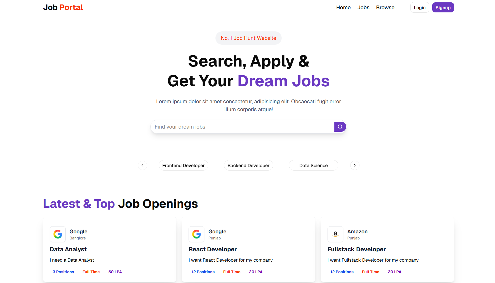
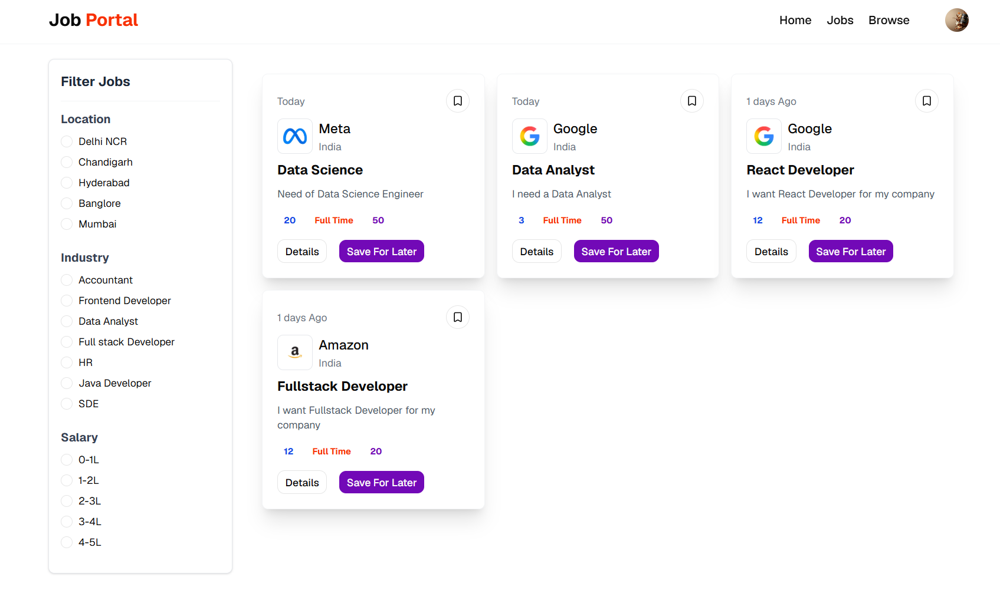
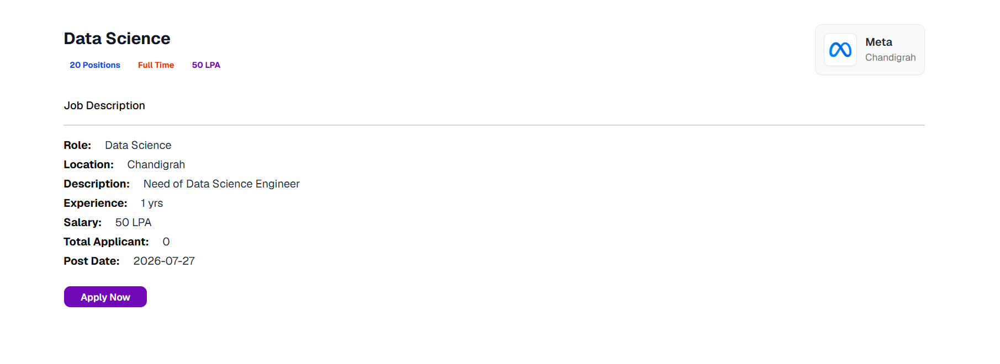
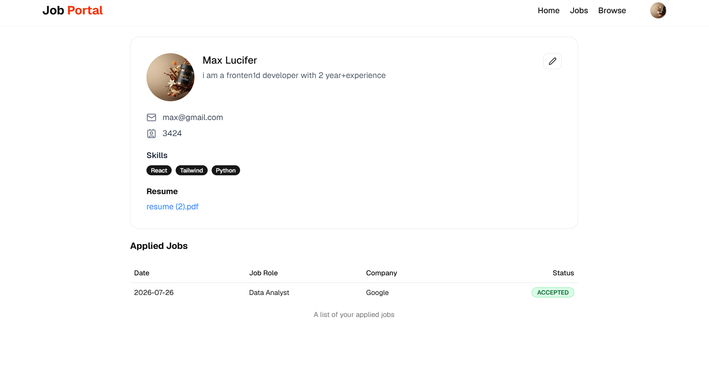
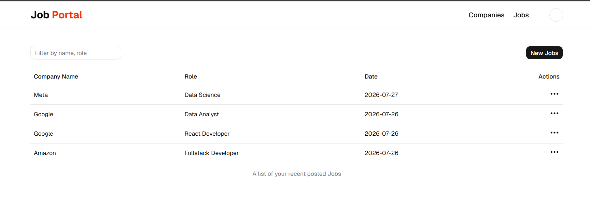
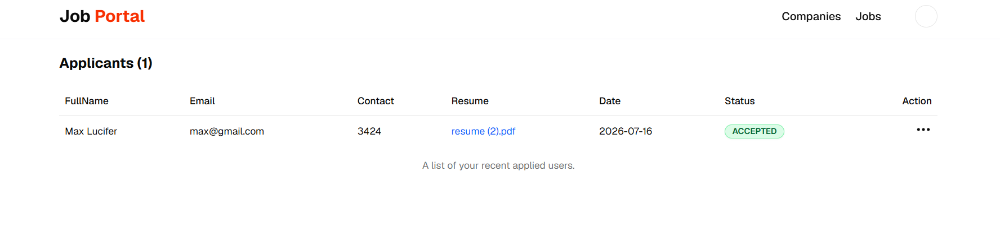
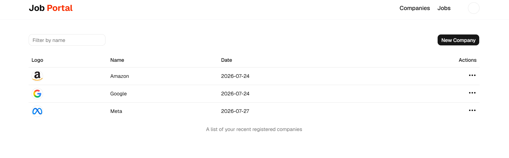

# Job Portal - Full-Stack MERN Application

<div align="center">


**A modern, full-stack job portal connecting job seekers with recruiters — built on the MERN stack with role-based authentication, cloud media uploads, and a fully responsive UI.**

</div>

---

## Table of Contents

- [Demo](#demo)
- [Screenshots](#screenshots)
- [Features](#features)
- [Tech Stack](#tech-stack)
- [Project Structure](#project-structure)
- [Installation](#installation)
- [Environment Variables](#environment-variables)
- [API Overview](#api-overview)
- [Usage](#usage)
- [Responsive Design](#responsive-design)
- [Security](#security)
- [Future Improvements](#future-improvements)
- [Contributing](#contributing)
- [License](#license)
- [Author](#author)
- [Acknowledgements](#acknowledgements)

---

## Demo

| Resource | URL |
|---|---|
| Frontend (Local Dev) | `http://localhost:5173` |
| Backend API (Local Dev) | `http://localhost:4000/api/v1` |
| Live Demo | _Not yet deployed — add your URL here_ |

---

## Screenshots

> Add screenshots to `docs/screenshots/` and update the table below.

| Page | Screenshot |
|---|---|
| Home Page |  |
| Job Listings |  |
| Job Description |  |
| Student Profile |  |
| Admin - Manage Jobs |  |
| Admin - Applicants |  |
| Company Setup |  |

---

## Features

### Authentication & Authorization
- User Registration & Login
- JWT-based Authentication (HTTP-only cookies)
- Role-based access — **Student** and **Recruiter**
- Protected Routes (admin panel restricted to recruiters only)
- Auto-redirect based on role after login/logout

### Job Seeker (Student)
- Browse and search all available jobs
- Real-time keyword filtering
- Category carousel for quick job filtering
- Detailed job description page
- One-click job application
- Track all applied jobs with live status updates (Pending / Accepted / Rejected)
- Full profile management (Name, Email, Phone, Bio, Skills)
- Resume upload (PDF) via Cloudinary
- Profile picture upload with instant circular preview

### Recruiter
- Register and manage companies with logo upload
- Post new job listings with full details
- View all posted jobs in a searchable table
- View all applicants per job listing
- Accept or Reject individual applicants
- Protected admin dashboard — accessible only to recruiters

### UI / UX
- Fully responsive on Mobile, Tablet, Laptop, and Desktop
- Animated HeroSection using Framer Motion
- Category Carousel powered by Embla
- Toast notifications via Sonner
- Loading spinners on all async actions
- Shadcn/UI component library with Radix UI primitives
- Geist Variable font
- Redux state persistence via redux-persist

---

## Tech Stack

### Frontend
| Technology | Version | Purpose |
|---|---|---|
| React | 19 | UI Library |
| Vite | 8 | Build Tool |
| Tailwind CSS | 4 | Styling |
| Redux Toolkit | 2 | State Management |
| redux-persist | 6 | State Persistence |
| React Router DOM | 7 | Client-side Routing |
| Axios | 1 | HTTP Client |
| Shadcn/UI | 4 | Component Library |
| Radix UI | 1 | Accessible Primitives |
| Framer Motion | 12 | Animations |
| Embla Carousel | 8 | Category Carousel |
| Lucide React | 1 | Icons |
| Sonner | 2 | Toast Notifications |

### Backend
| Technology | Version | Purpose |
|---|---|---|
| Node.js | — | Runtime |
| Express.js | 5 | Web Framework |
| MongoDB | — | Database |
| Mongoose | 9 | ODM / Schema Modeling |
| JSON Web Token | 9 | Authentication |
| bcrypt | 6 | Password Hashing |
| Multer | 2 | File Upload Handling |
| Cloudinary SDK | 2 | Cloud Media Storage |
| datauri | 4 | Buffer to Data URI |
| cookie-parser | 1 | Cookie Parsing |
| cors | 2 | CORS Handling |
| dotenv | 17 | Environment Variables |
| nodemon | 3 | Dev Auto-restart |

### Tools
| Tool | Purpose |
|---|---|
| Git & GitHub | Version Control |
| Postman | API Testing |
| VS Code | Code Editor |
| npm | Package Manager |
| ESLint | Code Linting |

---

## Project Structure

```
job-search/
├── backend/
│   ├── controllers/
│   │   ├── application.controller.js   # Apply, status update logic
│   │   ├── company.controller.js       # Company CRUD
│   │   ├── job.controller.js           # Job CRUD
│   │   └── user.controller.js          # Auth + profile update
│   ├── middleware/
│   │   ├── isAuthenticated.js          # JWT verification
│   │   └── multer.js                   # File upload configs (single + fields)
│   ├── models/
│   │   ├── application.model.js
│   │   ├── company.model.js
│   │   ├── job.model.js
│   │   └── user.model.js
│   ├── routes/
│   │   ├── application.route.js
│   │   ├── company.route.js
│   │   ├── job.route.js
│   │   └── user.route.js
│   ├── utils/
│   │   ├── cloudinary.js               # Cloudinary SDK config
│   │   ├── datauri.js                  # Buffer to Data URI helper
│   │   └── db.js                       # MongoDB connection
│   ├── .env
│   ├── index.js                        # Express app entry point
│   └── package.json
│
└── frontend/
    ├── src/
    │   ├── admin/                      # Recruiter-only pages
    │   │   ├── AdminJobs.jsx
    │   │   ├── AdminJobsTable.jsx
    │   │   ├── Applicants.jsx
    │   │   ├── ApplicantsTable.jsx
    │   │   ├── Companies.jsx
    │   │   ├── CompaniesTable.jsx
    │   │   ├── CompanyCreate.jsx
    │   │   ├── CompanySetup.jsx
    │   │   ├── PostJob.jsx
    │   │   └── ProtectedRoute.jsx
    │   ├── components/
    │   │   ├── auth/
    │   │   │   ├── Login.jsx
    │   │   │   └── Signup.jsx
    │   │   ├── shared/
    │   │   │   └── Navbar.jsx
    │   │   ├── ui/                     # Shadcn/UI components
    │   │   ├── AppliedJobTable.jsx
    │   │   ├── Browse.jsx
    │   │   ├── CategoryCarousel.jsx
    │   │   ├── FilterCard.jsx
    │   │   ├── Footer.jsx
    │   │   ├── HeroSection.jsx
    │   │   ├── Home.jsx
    │   │   ├── Job.jsx
    │   │   ├── JobDescription.jsx
    │   │   ├── Jobs.jsx
    │   │   ├── LatestJobCards.jsx
    │   │   ├── LatestJobs.jsx
    │   │   ├── Profile.jsx
    │   │   └── UpdateProfileDialogue.jsx
    │   ├── hooks/                      # Custom React hooks
    │   ├── redux/                      # Redux slices + store
    │   ├── utils/
    │   │   └── constant.js             # API base URLs
    │   ├── App.jsx
    │   └── main.jsx
    └── package.json
```

---

## Installation

### Prerequisites
- Node.js `v18+`
- MongoDB (local or Atlas)
- Cloudinary account
- npm

### 1. Clone the Repository

```bash
git clone https://github.com/daksh-rajora/job-search.git
cd job-search
```

### 2. Setup Backend

```bash
cd backend
npm install
```

Create a `.env` file in `backend/` (see [Environment Variables](#environment-variables)).

```bash
npm run dev
# Backend running at http://localhost:4000
```

### 3. Setup Frontend

```bash
cd ../frontend
npm install
npm run dev
# Frontend running at http://localhost:5173
```

---

## Environment Variables

### `backend/.env`

```env
PORT=4000
MONGO_URI=mongodb+srv://<username>:<password>@cluster.mongodb.net/job-portal
SECRET_KEY=your_super_secret_jwt_key
CLOUD_NAME=your_cloudinary_cloud_name
API_KEY=your_cloudinary_api_key
API_SECRET=your_cloudinary_api_secret
```

> **Note:** Frontend API base URLs are hardcoded in `frontend/src/utils/constant.js`.  
> Update them to your deployed backend URL before going to production.

---

## API Overview

Base URL: `http://localhost:4000/api/v1`

### Auth / Users — `/api/v1/user`

| Method | Endpoint | Auth | Purpose |
|---|---|---|---|
| POST | `/register` | No | Register new user (with optional profile photo) |
| POST | `/login` | No | Login, receive JWT cookie |
| GET | `/logout` | No | Logout, clear JWT cookie |
| POST | `/profile/update` | Yes | Update profile, resume (PDF), profile picture |

### Companies — `/api/v1/company`

| Method | Endpoint | Auth | Purpose |
|---|---|---|---|
| POST | `/register` | Yes | Register a company |
| GET | `/get` | Yes | Get all companies for logged-in recruiter |
| GET | `/get/:id` | Yes | Get a single company by ID |
| PUT | `/update/:id` | Yes | Update company info + logo |

### Jobs — `/api/v1/job`

| Method | Endpoint | Auth | Purpose |
|---|---|---|---|
| POST | `/post` | Yes | Post a new job (recruiter only) |
| GET | `/get` | Yes | Get all jobs (keyword filter supported) |
| GET | `/getAdminJobs` | Yes | Get jobs posted by logged-in recruiter |
| GET | `/get/:id` | Yes | Get a single job by ID |

### Applications — `/api/v1/application`

| Method | Endpoint | Auth | Purpose |
|---|---|---|---|
| GET | `/apply/:id` | Yes | Apply to a job |
| GET | `/get` | Yes | Get student's applied jobs |
| GET | `/:id/applicants` | Yes | Get all applicants for a job |
| POST | `/status/:id/update` | Yes | Update applicant status (Accept/Reject) |

---

## Usage

### Job Seeker (Student)

1. Register at `/signup` — choose **Student** role
2. Login at `/login`
3. Browse jobs at `/jobs` or `/browse`
4. Use the search bar or category carousel to filter jobs
5. Click any job card to read the full description
6. Click **Apply Now** to apply
7. Go to `/profile` to:
   - Update name, bio, skills, phone number, email
   - Upload a new profile picture (shows circular preview instantly)
   - Upload or replace your resume (PDF)
8. Track applied jobs and their status in your profile page

### Recruiter

1. Register at `/signup` — choose **Recruiter** role
2. Login at `/login`
3. Go to **Admin → Companies** → create a company
4. Upload company logo on the Company Setup page
5. Go to **Admin → Jobs** → post a new job
6. View all applicants per job
7. Accept or Reject candidates from the Applicants page

---

## Responsive Design

| Device | Breakpoint | Layout |
|---|---|---|
| Mobile | `< 640px` | Single column, full-width forms, hamburger nav |
| Tablet | `640px – 1024px` | 2-column grids, compact cards |
| Laptop | `1024px – 1280px` | Full desktop layout |
| Desktop | `> 1280px` | Max-width centered content |

Responsive pages:
- Login & Signup — full-width card on mobile, max-w-sm centered
- Update Profile — dialog adapts to screen size
- Job listings — responsive grid cards
- Admin PostJob — 1-col mobile, 2-col desktop
- Admin CompanySetup — 1-col mobile, 2-col desktop
- Browse — 1/2/3 column responsive grid

---

## Security

| Feature | Implementation |
|---|---|
| Password Hashing | `bcrypt` with 10 salt rounds |
| Authentication | JWT stored in HTTP-only cookies |
| Route Protection | `isAuthenticated` middleware on all private routes |
| Role-Based Access | `ProtectedRoute` component restricts recruiter pages |
| CORS | Localhost whitelist — update origin for production |
| File Validation | Multer for server-side + image type check on frontend |
| Email Uniqueness | Checked before update — returns user-friendly error |

---

## Future Improvements

- [ ] Email notifications when application status changes
- [ ] Pagination for job listings
- [ ] Job bookmarking / saved jobs list
- [ ] Advanced search filters (salary range, job type, location)
- [ ] Real-time notifications using Socket.IO
- [ ] Dark Mode (next-themes already installed)
- [ ] Resume parsing — auto-fill profile from uploaded PDF
- [ ] Analytics dashboard for recruiters
- [ ] Production deployment (Render backend + Vercel frontend)
- [ ] Rate limiting on auth routes
- [ ] JWT refresh token rotation

---

## Contributing

```bash
# Fork the repo, then:
git checkout -b feature/your-feature-name
git commit -m "feat: describe your change"
git push origin feature/your-feature-name
# Open a Pull Request
```

Follow [Conventional Commits](https://www.conventionalcommits.org/): `feat:`, `fix:`, `docs:`, `chore:`, `refactor:`

---

## License

MIT License © 2024 Daksh Rajora

---

## Author

| Field | Details |
|---|---|
| **Name** | Daksh Rajora |
| **GitHub** | [@daksh-rajora](https://github.com/daksh-rajora) |
| **Email** | dakshrajora11@gmail.com |
| **LinkedIn** | [linkedin.com/in/dakshrajora](https://www.linkedin.com/in/dakshrajora) |

---

## Acknowledgements

[React](https://react.dev/) · [Vite](https://vitejs.dev/) · [Tailwind CSS](https://tailwindcss.com/) · [Shadcn/UI](https://ui.shadcn.com/) · [Redux Toolkit](https://redux-toolkit.js.org/) · [Framer Motion](https://www.framer.com/motion/) · [Embla Carousel](https://www.embla-carousel.com/) · [Cloudinary](https://cloudinary.com/) · [MongoDB Atlas](https://www.mongodb.com/cloud/atlas) · [Lucide Icons](https://lucide.dev/) · [Sonner](https://sonner.emilkowal.ski/)

---

<div align="center">

Star this repo if you found it useful!

Made with love by Daksh Rajora

</div>
