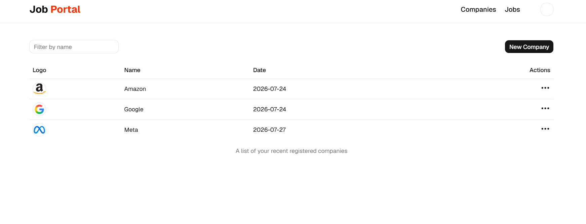

# ?? Job Portal � Full-Stack MERN Application

<div align="center">


**A modern, full-stack job portal connecting job seekers with recruiters � built on the MERN stack with role-based authentication, cloud media, and a fully responsive UI.**

</div>

---

## ?? Table of Contents

- [Demo](#-demo)
- [Screenshots](#-screenshots)
- [Features](#-features)
- [Tech Stack](#-tech-stack)
- [Project Structure](#-project-structure)
- [Installation](#-installation)
- [Environment Variables](#-environment-variables)
- [API Overview](#-api-overview)
- [Usage](#-usage)
- [Responsive Design](#-responsive-design)
- [Security](#-security)
- [Future Improvements](#-future-improvements)
- [Contributing](#-contributing)
- [License](#-license)
- [Author](#-author)
- [Acknowledgements](#-acknowledgements)

---

## ?? Demo

| Resource | URL |
|---|---|
| ??? Frontend (Local Dev) | `http://localhost:5173` |
| ?? Backend API (Local Dev) | `http://localhost:4000/api/v1` |
| ?? Live Demo | _Not yet deployed � add your URL here_ |

---

## ?? Screenshots

> Add screenshots to `docs/screenshots/` and embed them here.

## 📸 Screenshots

| Page | Screenshot |
|---|---|
| Home Page |  |
| Job Listings |  |
| Profile |  |
| Admin Dashboard |  |


---

## ? Features

### ?? Authentication & Authorization
- ? User Registration & Login
- ? JWT-based Authentication (HTTP-only cookies)
- ? Role-based access � **Student** and **Recruiter**
- ? Protected Routes (admin panel restricted to recruiters)
- ? Auto-redirect on login/logout

### ?? Job Seeker (Student)
- ? Search and browse all available jobs
- ? Real-time keyword filtering
- ? Category carousel for quick filtering
- ? Detailed job description page
- ? One-click job application
- ? Track applied jobs and statuses
- ? Profile management (Name, Email, Phone, Bio, Skills)
- ? Resume upload (PDF) to Cloudinary
- ? Profile picture upload with circular preview

### ?? Recruiter
- ? Create and manage companies
- ? Company logo upload to Cloudinary
- ? Post new job listings
- ? View all posted jobs
- ? View all applicants per job
- ? Accept / Reject applicants

### ?? UI / UX
- ? Fully responsive on all devices
- ? Animated HeroSection (Framer Motion)
- ? Category Carousel (Embla)
- ? Toast notifications (Sonner)
- ? Loading spinners
- ? Shadcn/UI components
- ? Geist Variable font
- ? State persistence (redux-persist)

---

## ??? Tech Stack

### Frontend
| Technology | Version | Purpose |
|---|---|---|
| React | 19 | UI Library |
| Vite | 8 | Build Tool |
| Tailwind CSS | 4 | Styling |
| Redux Toolkit | 2 | State Management |
| redux-persist | 6 | State Persistence |
| React Router DOM | 7 | Routing |
| Axios | 1 | HTTP Client |
| Shadcn/UI | 4 | Component Library |
| Framer Motion | 12 | Animations |
| Embla Carousel | 8 | Carousel |
| Lucide React | 1 | Icons |
| Sonner | 2 | Toasts |

### Backend
| Technology | Version | Purpose |
|---|---|---|
| Node.js | � | Runtime |
| Express.js | 5 | Web Framework |
| MongoDB | � | Database |
| Mongoose | 9 | ODM |
| JWT | 9 | Authentication |
| bcrypt | 6 | Password Hashing |
| Multer | 2 | File Uploads |
| Cloudinary SDK | 2 | Media Storage |
| cookie-parser | 1 | Cookies |
| cors | 2 | CORS |
| dotenv | 17 | Environment Variables |
| nodemon | 3 | Dev Auto-restart |

---

## ?? Project Structure

```
job-search/
+-- backend/
�   +-- controllers/
�   �   +-- application.controller.js
�   �   +-- company.controller.js
�   �   +-- job.controller.js
�   �   +-- user.controller.js
�   +-- middleware/
�   �   +-- isAuthenticated.js
�   �   +-- multer.js
�   +-- models/
�   �   +-- application.model.js
�   �   +-- company.model.js
�   �   +-- job.model.js
�   �   +-- user.model.js
�   +-- routes/
�   �   +-- application.route.js
�   �   +-- company.route.js
�   �   +-- job.route.js
�   �   +-- user.route.js
�   +-- utils/
�   �   +-- cloudinary.js
�   �   +-- datauri.js
�   �   +-- db.js
�   +-- .env
�   +-- index.js
�   +-- package.json
�
+-- frontend/
    +-- src/
    �   +-- admin/
    �   �   +-- AdminJobs.jsx
    �   �   +-- Applicants.jsx
    �   �   +-- Companies.jsx
    �   �   +-- CompanyCreate.jsx
    �   �   +-- CompanySetup.jsx
    �   �   +-- PostJob.jsx
    �   �   +-- ProtectedRoute.jsx
    �   +-- components/
    �   �   +-- auth/
    �   �   �   +-- Login.jsx
    �   �   �   +-- Signup.jsx
    �   �   +-- shared/Navbar.jsx
    �   �   +-- ui/            (Shadcn components)
    �   �   +-- Browse.jsx
    �   �   +-- CategoryCarousel.jsx
    �   �   +-- FilterCard.jsx
    �   �   +-- HeroSection.jsx
    �   �   +-- Home.jsx
    �   �   +-- JobDescription.jsx
    �   �   +-- Jobs.jsx
    �   �   +-- Profile.jsx
    �   �   +-- UpdateProfileDialogue.jsx
    �   +-- hooks/
    �   +-- redux/
    �   +-- utils/
    �   �   +-- constant.js
    �   �   +-- cropImage.js
    �   +-- App.jsx
    �   +-- main.jsx
    +-- package.json
```

---

## ?? Installation

### Prerequisites
- Node.js `v18+`
- MongoDB (local or Atlas)
- Cloudinary account
- npm

### 1. Clone the Repository

```bash
git clone https://github.com/daksh-rajora/job-search.git
cd job-search
```

### 2. Setup Backend

```bash
cd backend
npm install
# Create .env file (see Environment Variables section)
npm run dev
# Backend: http://localhost:4000
```

### 3. Setup Frontend

```bash
cd ../frontend
npm install
npm run dev
# Frontend: http://localhost:5173
```

---

## ?? Environment Variables

### `backend/.env`

```env
PORT=4000
MONGO_URI=mongodb+srv://<username>:<password>@cluster.mongodb.net/job-portal
SECRET_KEY=your_super_secret_jwt_key
CLOUD_NAME=your_cloudinary_cloud_name
API_KEY=your_cloudinary_api_key
API_SECRET=your_cloudinary_api_secret
```

> ?? The frontend API URLs are hardcoded in `src/utils/constant.js`.  
> Update them before deploying to production.

---

## ?? API Overview

Base: `http://localhost:4000/api/v1`

### Users � `/api/v1/user`

| Method | Endpoint | Auth | Purpose |
|---|---|---|---|
| POST | `/register` | ? | Register new user |
| POST | `/login` | ? | Login, receive JWT cookie |
| GET | `/logout` | ? | Logout, clear cookie |
| POST | `/profile/update` | ? | Update profile, resume, photo |

### Companies � `/api/v1/company`

| Method | Endpoint | Auth | Purpose |
|---|---|---|---|
| POST | `/register` | ? | Register company |
| GET | `/get` | ? | Get recruiter's companies |
| GET | `/get/:id` | ? | Get company by ID |
| PUT | `/update/:id` | ? | Update company + logo |

### Jobs � `/api/v1/job`

| Method | Endpoint | Auth | Purpose |
|---|---|---|---|
| POST | `/post` | ? | Post new job |
| GET | `/get` | ? | Get all jobs (filterable) |
| GET | `/getAdminJobs` | ? | Get recruiter's jobs |
| GET | `/get/:id` | ? | Get job by ID |

### Applications � `/api/v1/application`

| Method | Endpoint | Auth | Purpose |
|---|---|---|---|
| GET | `/apply/:id` | ? | Apply to a job |
| GET | `/get` | ? | Get student's applications |
| GET | `/:id/applicants` | ? | Get job applicants (recruiter) |
| POST | `/status/:id/update` | ? | Update application status |

---

## ?? Usage

### ?? Job Seeker
1. Register at `/signup` ? choose **Student**
2. Browse jobs at `/jobs` or `/browse`
3. Use search bar or category filter
4. Click a job ? read description ? **Apply Now**
5. Go to `/profile` ? update info, upload resume & photo
6. View applied jobs and their statuses in your profile table

### ?? Recruiter
1. Register at `/signup` ? choose **Recruiter**
2. Go to **Admin ? Companies** ? create a company
3. Upload your company logo on Company Setup page
4. Go to **Admin ? Jobs** ? post a new job
5. View applicants per job
6. Accept or Reject candidates

---

## ?? Responsive Design

| Device | Layout |
|---|---|
| ?? Mobile `< 640px` | Single column, hamburger nav |
| ?? Tablet `640�1024px` | 2-column grids |
| ?? Laptop `1024�1280px` | Full layout |
| ??? Desktop `> 1280px` | Max-width centered |

---

## ?? Security

| Feature | Implementation |
|---|---|
| Password Hashing | `bcrypt` (10 rounds) |
| Authentication | JWT in HTTP-only cookies |
| Route Protection | `isAuthenticated` middleware |
| Role-Based Access | `ProtectedRoute` component |
| CORS | Localhost whitelist (update for prod) |
| File Validation | Multer + frontend image type check |

---

## ?? Future Improvements

- [ ] Email notifications on application status change
- [ ] Pagination for job listings
- [ ] Job bookmarking / saved jobs
- [ ] Advanced filters (salary, job type, location)
- [ ] Real-time notifications via Socket.IO
- [ ] Dark Mode (next-themes already installed)
- [ ] Resume parsing (auto-fill profile)
- [ ] Analytics dashboard for recruiters
- [ ] Production deployment (Render + Vercel)
- [ ] Rate limiting on auth routes
- [ ] Refresh token rotation

---

## ?? Contributing

```bash
git checkout -b feature/your-feature
git commit -m "feat: your feature description"
git push origin feature/your-feature
# Open a Pull Request
```

Use [Conventional Commits](https://www.conventionalcommits.org/): `feat:`, `fix:`, `docs:`, `chore:`

---

## ?? License

MIT License � 2024 Daksh Rajora

---

## ????? Author

| | |
|---|---|
| **Name** | Daksh Rajora |
| **GitHub** | [@daksh-rajora](https://github.com/daksh-rajora) |
| **Email** | dakshrajora11@gmail.com |
| **LinkedIn** | _(Add your LinkedIn URL)_ |

---

## ?? Acknowledgements

[React](https://react.dev/) � [Vite](https://vitejs.dev/) � [Tailwind CSS](https://tailwindcss.com/) � [Shadcn/UI](https://ui.shadcn.com/) � [Redux Toolkit](https://redux-toolkit.js.org/) � [Framer Motion](https://www.framer.com/motion/) � [Cloudinary](https://cloudinary.com/) � [MongoDB Atlas](https://www.mongodb.com/cloud/atlas) � [Sonner](https://sonner.emilkowal.ski/)

---

<div align="center">
? Star this repo if you found it useful! ?

Made with ?? by Daksh Rajora
</div>
